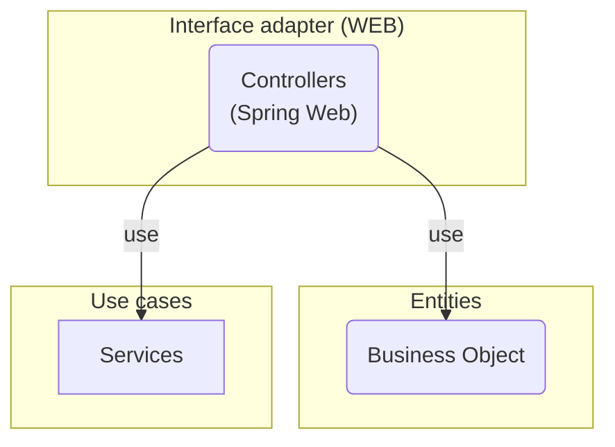
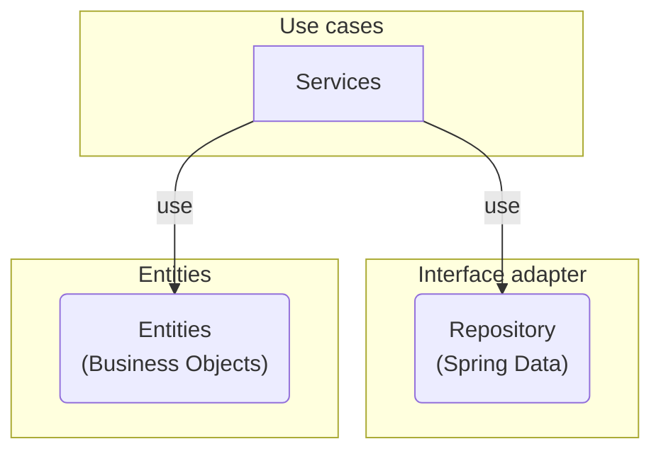
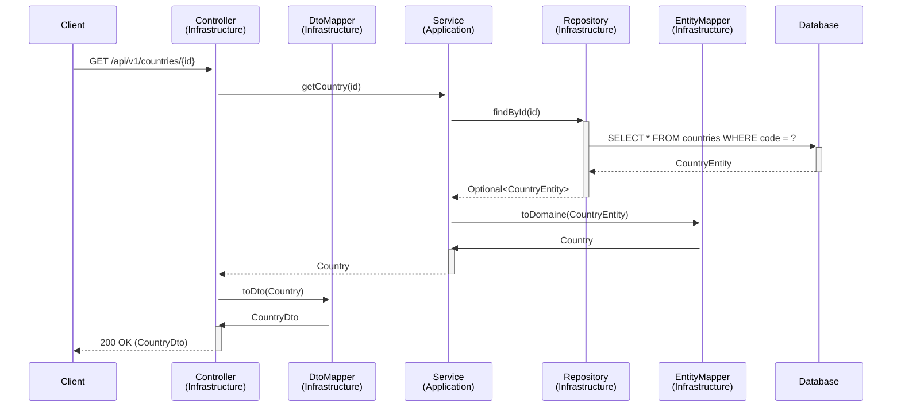

# Countries API

## Table of Contents

- [Technical points](#technical-points)
- [API Documentation](#api-documentation)
- [Features](#features)
  - [Countries](#countries)
    - [List Countries](#list-countries)
    - [Get a Country by Code](#get-a-country-by-code)
  - [Regions](#regions)
    - [List Regions](#list-regions)
    - [Get a Region by Code](#get-a-region-by-code)
    - [Get Countries by Region](#get-countries-by-region)
  - [Sub-Regions](#sub-regions)
    - [List Sub-Regions](#list-sub-regions)
    - [Get a Sub-Region by Code](#get-a-sub-region-by-code)
    - [Get Countries by Sub-Region](#get-countries-by-sub-region)

Countries API is a Spring Boot application based on a Postgresql DB.

## API Documentation

This project uses OpenAPI 3 for API documentation. Once the application is running, you can access the interactive Swagger UI at:
[`/swagger-ui.html`](http://localhost:8080/swagger-ui.html)

## Technical points

This project is structured following the principles of **Clean Architecture**. This approach separates the code into distinct layers, with a strict dependency rule: outer layers can depend on inner layers, but inner layers know nothing about the outer ones. This creates a more maintainable, testable, and framework-independent system.

### Architectural Layers

The diagram below shows the main layers of the application: **Entities**, **Use cases** and **Interface adapter**.

#### Controller view



#### Service view



### Request Flow Example

The following sequence diagram illustrates how a `GET /api/v1/countries/{id}` request flows through the different layers of the architecture.



We use [posting](https://posting.sh/) to test the API by the command

```shell
posting --env posting-collection/local.env --collection posting-collection
```

The sonar report is available on [SonarQube](https://sonarcloud.io/project/overview?id=KermabonStephane_countries-api).

## Features

The API provides the following features:

### Countries

A country contains information from the [ISO 3166-1](https://en.wikipedia.org/wiki/ISO_3166-1):

* ISO 3166-1 alpha-2 – two-letter country codes which are used most prominently for the Internet's country code top-level domains (with a few exceptions).
* ISO 3166-1 alpha-3 – three-letter country codes which allow a better visual association between the codes and the country names than the alpha-2 codes.
* ISO 3166-1 numeric – three-digit country codes which are identical to those developed and maintained by the United Nations Statistics Division, with the advantage of script (writing system) independence, and hence useful for people or systems using non-Latin scripts. This one is use as identifier for a country.
* The english name of the country.
* The code of the region and sub-region.

#### List Countries

- **Endpoint**: `GET /api/v1/countries`
- **Description**: Retrieves a list of all countries.
- **Pagination**: Supports pagination via the `Range` header (e.g., `Range: countries=0-9`). The response includes `Content-Range` and `Link` headers to facilitate navigation.
- **Sorting**: Supports sorting on country fields via the `sort` query parameter (e.g., `?sort=name:asc`).

#### Get a Country by Code

- **Endpoint**: `GET /api/v1/countries/{countryCode}`
- **Description**: Retrieves a single country by its unique numeric code.
- **Error Handling**: Returns a standard `404 Not Found` response with a JSON body if a country with the specified code does not exist.

### Regions

A region contains information from the [United Nations](https://unstats.un.org/unsd/methodology/m49/):

* ISO 3166-1 numeric – three-digit region codes which are identical to those developed and maintained by the United Nations Statistics Division, with the advantage of script (writing system) independence, and hence useful for people or systems using non-Latin scripts. This one is use as identifier for a country.
* The english name of the region.

#### List Regions

- **Endpoint**: `GET /api/v1/regions`
- **Description**: Retrieves a list of all available regions.
- **Pagination**: Supports pagination via the `Range` header (e.g., `Range: regions=0-9`). The response includes `Content-Range` and `Link` headers to facilitate navigation.
- **Sorting**: Supports sorting on region fields via the `sort` query parameter (e.g., `?sort=code:asc`).

#### Get a Region by Code

- **Endpoint**: `GET /api/v1/regions/{regionCode}`
- **Description**: Retrieves a single region by its unique numeric code.
- **Error Handling**: Returns a standard `404 Not Found` response with a JSON body if a region with the specified code does not exist.

#### Get Countries by Region

- **Endpoint**: `GET /api/v1/regions/{regionCode}/countries`
- **Description**: Retrieves a list of all countries belonging to a specific region.

### Sub-Regions

A sub-region contains information from the [United Nations](https://unstats.un.org/unsd/methodology/m49/):

* ISO 3166-1 numeric – three-digit sub-region codes which are identical to those developed and maintained by the United Nations Statistics Division, with the advantage of script (writing system) independence, and hence useful for people or systems using non-Latin scripts. This one is use as identifier for a country.
* The english name of the region.


#### List Sub-Regions

- **Endpoint**: `GET /api/v1/sub-regions`
- **Description**: Retrieves a list of all available sub-regions.
- **Pagination**: Supports pagination via the `Range` header (e.g., `Range: sub-regions=0-9`). The response includes `Content-Range` and `Link` headers to facilitate navigation.
- **Sorting**: Supports sorting on sub-region fields via the `sort` query parameter (e.g., `?sort=code:asc`).

#### Get a Sub-Region by Code

- **Endpoint**: `GET /api/v1/sub-regions/{subRegionCode}`
- **Description**: Retrieves a single sub-region by its unique numeric code.
- **Error Handling**: Returns a standard `404 Not Found` response with a JSON body if a sub-region with the specified code does not exist.

#### Get Countries by Sub-Region

- **Endpoint**: `GET /api/v1/sub-regions/{subRegionCode}/countries`
- **Description**: Retrieves a list of all countries belonging to a specific sub-region.
